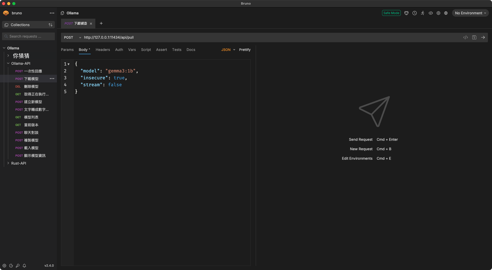

## Ollama + MongoDB + WKWebView 功能整合
##### 主要學習LLM模型 + 語意模型，簡單模擬一個類似AI法律小幫手的效果，過濾一些不符合事先選出來的文字內容，使用WKWebView直接實作，省下一些畫面處理的問題…


## 安裝流程
- 先安裝[OrbStack / Docker Desktop](https://william-weng.github.io/2025/01/docker容器大家一起來當鯨魚搬運工吧/)


- 所有的執行文件都在這裡
```html
./Example/Example/Material/Python/RandomMenu
```

- 再建立Ollama環境 (Ollama + MongoDB)
```bash
[<base>/RandomMenu/Docker]
docker-compose -f docker-compose.yml up -d
```


- 下載LLM模型 (gemma3:1b)
```html
[POST]
http://localhost:11434/api/pull
{
  "model": "gemma3:1b",
  "insecure": true,
  "stream": false
}
```


- 下載語意模型 (all-minilm)
```html
[POST]
http://localhost:11434/api/pull
{
  "model": "all-minilm",
  "insecure": true,
  "stream": false
}
```

- 該裝的Python 3.13.3套件裝一裝
```bash
[<base>/RandomMenu]
pip install -r requirements.txt
```

- 執行後台主程式
```bash
[<base>/]
python3 randomMenu.py
```


- 執行APP程式

